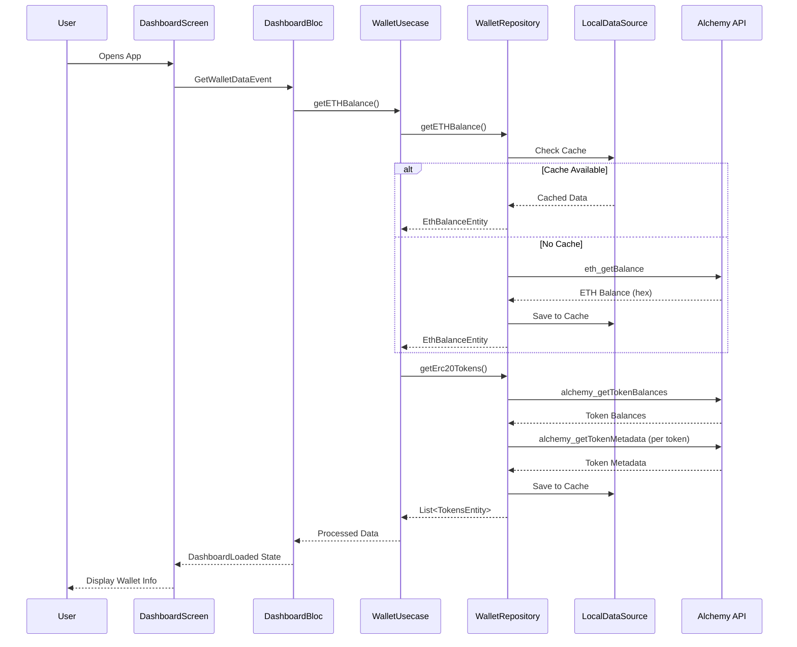

# Web3 Wallet Dashboard

Flutter application that displays wallet information including ETH balance and ERC-20 token balances

## 🚀 How to Run the App

### Prerequisites
- Flutter SDK (3.0.0 or higher)
- Dart SDK (3.0.0 or higher)
- Android Studio / VS Code with Flutter extensions
- Android device or emulator / iOS simulator

### Installation Steps

1. **Clone the repository**
   ```bash
   git clone git@github.com:Newiihuhu/web3-wallet-dashboard.git
   cd web3_wallet_dashboard
   ```

2. **Install dependencies**
   ```bash
   flutter pub get
   ```

3. **Set up environment variables**
   ```bash
   cp .env.example .env
   # Edit .env file with your API keys (see API Keys Setup section)
   ```

4. **Run the app**
   ```bash
   # For development
   flutter run
   ```

## 🔑 API Keys Setup

### Required API Keys

1. **Alchemy API Key**
   - Sign up at [Alchemy](https://www.alchemy.com/)
   - Create a new app and get your API key
   - Add to `.env` file:
     ```
     ALCHEMY_API_KEY=your_alchemy_api_key_here
     ```

2. **Environment File Setup**
   ```bash
   # Create .env file in project root
   touch .env
   
   # Add your API key
   echo "ALCHEMY_API_KEY=your_actual_api_key" >> .env
   ```

## 🧪 How to Run Tests

### Run All Tests
```bash
flutter test
```

### Run Specific Test Categories
```bash
# Unit tests only
flutter test test/domain/
flutter test test/data/

# Widget tests only
flutter test test/presentation/widgets/
```

### Run Tests with Coverage
```bash
flutter test --coverage
genhtml coverage/lcov.info -o coverage/html
open coverage/html/index.html
```

### Golden Tests (Visual Regression Tests)
```bash
# Run golden tests
flutter test test/presentation/widgets/simple_golden_tests.dart             # Basic golden tests
flutter test test/presentation/widgets/responsive_golden_tests.dart         # Responsive tests

# Generate/Update golden files
flutter test --update-goldens test/presentation/widgets/golden_tests.dart

# Using the golden test script
./scripts/run_golden_tests.sh --update      # Update all golden files
./scripts/run_golden_tests.sh --all         # Run all golden tests
./scripts/run_golden_tests.sh --basic       # Run basic golden tests only
```

## 🏗️ Architectural Decisions

### Clean Architecture Implementation

The app follows Clean Architecture principles with clear separation of concerns:

```
lib/
├── core/                   # Core utilities and configurations
│   ├── config/             # App configuration
│   ├── constants/          # App constants
│   ├── exception/          # Custom exceptions
│   ├── injection/          # Dependency injection
│   ├── theme/              # App theming
│   └── utils/              # Utility functions
├── data/                   # Data layer
│   ├── datasources/        # Data sources (remote & local)
│   ├── models/             # Data models
│   └── repositories/       # Repository implementations
├── domain/                 # Domain layer
│   ├── entities/           # Business entities
│   ├── repositories/       # Repository interfaces
│   └── usecases/           # Use cases
└── presentation/           # Presentation layer
    ├── bloc/               # State management
    ├── widgets/            # UI components
    └── dashboard_screen.dart
```

### Key Architectural Decisions

#### 1. **State Management: BLoC Pattern**
- **Why**: Predictable state management with clear separation of business logic
- **Benefits**: Testable, maintainable, and follows Flutter best practices
- **Implementation**: `DashboardBloc` manages wallet data state

#### 2. **Dependency Injection: GetIt**
- **Why**: Simple and efficient service locator pattern
- **Benefits**: Easy testing with mock dependencies
- **Implementation**: `service_locator.dart` manages all dependencies

#### 3. **Data Layer: Repository Pattern**
- **Why**: Abstracts data sources and provides clean interface
- **Benefits**: Easy to switch between remote and local data sources
- **Implementation**: 
  - `WalletRepository` interface
  - `WalletRepositoryImpl` with remote and local data sources

#### 4. **Local Caching: SharedPreferences**
- **Why**: Simple key-value storage for caching wallet data
- **Benefits**: Improves app performance and offline capability
- **Implementation**: Separate local data sources for different data types


#### 5. **API Integration: Alchemy**
- **Why**: Offers developer-friendly APIs on the Sepolia testnet, which directly match the assignment requirements.
- **Benefits**: Provides higher-level JSON-RPC methods like alchemy_getTokenBalances and alchemy_getTokenMetadata, which simplify fetching ETH and ERC-20 balances.
- **Implementation**: `WalletRemoteDatasource` handles all API calls

### API Endpoints Used
- **ETH Balance**: `eth_getBalance`
- **Token Balances**: `alchemy_getTokenBalances`
- **Token Metadata**: `alchemy_getTokenMetadata`


### Testing Strategy

#### 1. **Unit Tests**
- **Coverage**: Domain entities, use cases, and utilities
- **Focus**: Business logic and data transformations
- **Tools**: `flutter_test`, `mocktail`, `bloc_test`

#### 2. **Widget Tests**
- **Coverage**: UI components and user interactions
- **Focus**: Widget rendering and user interactions
- **Tools**: `flutter_test`, `WidgetTester`

## 📱 Features

- **Wallet Address Display**: Shows wallet address with copy functionality
- **ETH Balance**: Displays ETH balance in both ETH and USD
- **Token Balances**: Lists all ERC-20 tokens with balances and USD values
- **Real-time Data**: Fetches latest data from Alchemy API
- **Offline Support**: Caches data locally for offline viewing
- **Error Handling**: Graceful error handling with retry functionality

## 🔄 Data Flow


### Data Flow Components

| Component | Responsibility |
|-----------|----------------|
| **DashboardScreen** | UI presentation and user interaction |
| **DashboardBloc** | State management and business logic coordination |
| **WalletUsecase** | Business logic and use case orchestration |
| **WalletRepository** | Data access abstraction and caching strategy |
| **RemoteDataSource** | API communication with Alchemy |
| **LocalDataSource** | Local storage and caching |
| **Models** | Data transfer objects from API |
| **Entities** | Business domain objects |

